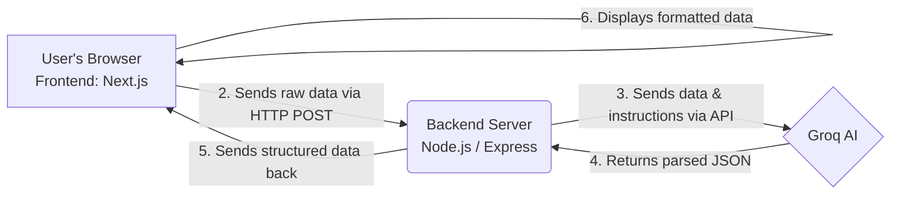
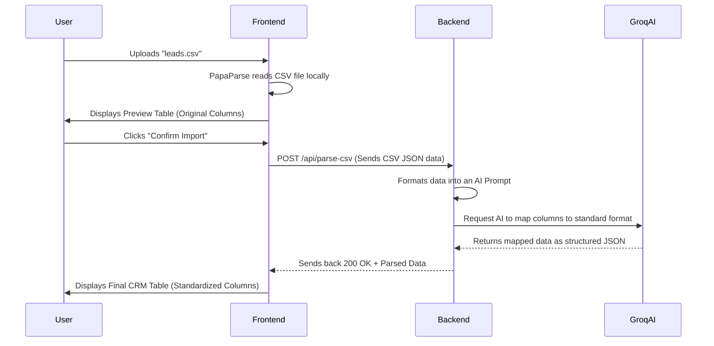

# AI-Powered CSV Importer: Architecture Overview

Welcome to the team! I'm thrilled to be your mentor for this project. As a senior engineer, my goal is to make sure you not only build this application but also thoroughly understand *why* we are making each technical decision. 

We are going to build an application that takes a chaotic, unpredictable CSV file (like a list of contacts with weird column names like "First Nm", "Phn", "Email Addr") and uses AI to neatly organize it into a standard format.

Let's break down the architecture and how the entire project will work.

## 1. High-Level Architecture

The project is split into two main parts that talk to each other over the internet: the **Frontend** (Client) and the **Backend** (Server). The Backend also talks to a third-party service: **Groq AI**.



### Component Breakdown:
*   **Frontend (Next.js):** This is what the user sees and interacts with. It handles file uploads, shows the initial messy CSV data in a table, and eventually displays the cleaned-up data.
*   **Backend (Node.js & Express):** This is the brain behind the scenes. It receives the data from the frontend, prepares a prompt, and talks to the AI. We keep the AI communication on the backend so our secret API keys are safe from the user's browser.
*   **Groq AI:** This is a super-fast AI model provider. We will feed it the messy CSV headers and data, and give it strict instructions to map the data to our standard format.

## 2. Step-by-Step Workflow

Let's trace the exact path of a piece of data from the moment the user clicks "Upload".



**Here's the detailed explanation of what happens in each step:**

1.  **File Selection:** The user picks a CSV file on their computer.
2.  **Local Parsing:** Instead of sending the heavy file to the server immediately, we use a package called `PapaParse` on the frontend. This reads the file inside the browser and converts it into a JavaScript array (a list of data).
3.  **Preview:** The frontend takes this list and renders a simple table. This lets the user verify, "Yes, this is the right file."
4.  **Confirmation:** The user clicks "Confirm Import".
5.  **Sending to Backend:** The frontend packages the data and sends an HTTP `POST` request to our Node.js backend.
6.  **AI Prompting:** The backend receives the data. It creates a message for Groq AI that says something like: *"Here is some raw contact data. The columns might be named weirdly. Please map them to these exact fields: firstName, lastName, email, phone, company. Return the answer in JSON format."*
7.  **AI Processing:** Groq processes the request and intelligently figures out that "mail address" means `email`, and "tele" means `phone`.
8.  **Display:** The backend forwards the clean JSON data back to the frontend, which renders the final, beautiful table using Shadcn UI components.

## 3. Tech Stack Explained

Let's understand *why* we are using these specific tools.

### Frontend: Next.js 15 (App Router), Tailwind CSS, Shadcn UI
*   **Next.js:** This is a React framework. Pure React is great, but Next.js gives us folder-based routing (creating pages easily) and optimization out of the box. 
*   **Tailwind CSS:** Normally, you write CSS in separate `.css` files. Tailwind lets you style elements directly by adding class names (like `bg-blue-500` for a blue background). It speeds up development drastically.
*   **Shadcn UI:** Building beautiful buttons, tables, and dialogs from scratch is hard. Shadcn provides pre-built, accessible, and beautifully designed components that we can copy into our project and customize.
*   **PapaParse:** The fastest and most reliable library for converting CSV text into JavaScript objects directly in the browser.

### Backend: Node.js, Express
*   **Node.js:** Allows us to run JavaScript on the server. Since we are using Next.js (JavaScript) on the frontend, using Node.js means we can use the same language everywhere.
*   **Express:** Node.js by itself requires a lot of code to set up a web server. Express is a minimalist framework that makes creating API endpoints (like `POST /api/parse-csv`) incredibly simple.

### AI: Groq API
*   **Groq API:** Groq provides access to open-source models (like Llama 3) running on specialized hardware (LPUs) that make them incredibly fast. Speed is crucial here so the user isn't waiting 30 seconds for their CSV to import.

### Deployment: Vercel & Render
*   **Vercel:** The company behind Next.js. Deploying a Next.js frontend here is usually as simple as pushing code to GitHub.
*   **Render:** A fantastic platform for hosting Node.js backends easily.

## 4. The "Standard CRM Format"

Before we write code, we need to define our goal. What is the "standard" format the AI should output? We will define a rigid structure. For example, every row returned by the AI *must* look like this, regardless of what the original CSV looked like:

```json
{
  "firstName": "John",
  "lastName": "Doe",
  "email": "john@example.com",
  "phone": "+1234567890",
  "company": "Acme Corp"
}
```

## 5. Preview of Our Project Structure

Here is how we will organize our code. Don't worry about memorizing this, I will guide you through creating each file when the time comes.

```text
groweasy_ass/
│
├── frontend/                 # All our Next.js UI code lives here
│   ├── src/
│   │   ├── app/              # Next.js App Router (Pages & Layouts)
│   │   ├── components/       # Reusable UI pieces (Buttons, Tables, FileUpload)
│   │   └── lib/              # Utility functions
│   ├── package.json          # Frontend dependencies
│   └── ...
│
└── backend/                  # All our Node.js Server code lives here
    ├── src/
    │   ├── controllers/      # Functions that handle requests (e.g., handleCSVUpload)
    │   ├── services/         # Functions that talk to Groq AI
    │   ├── routes/           # Defines the API endpoints (e.g., /api/parse-csv)
    │   └── index.js          # The entry point of our server
    ├── package.json          # Backend dependencies
    └── .env                  # Secret API keys (NEVER pushed to GitHub)
```

---

Take your time to read through this. Let me know if you have any questions about how these pieces fit together. Once you confirm you understand the architecture, we will move on to initializing the project folders and installing our very first tools!
